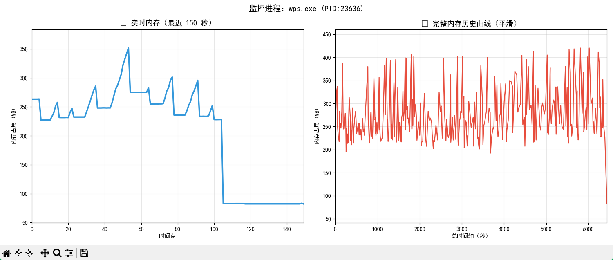

# 进程内存监控工具

一个基于 Python + Matplotlib 的进程内存实时监控工具，支持双图实时显示和 Y 轴自动缩放。

## 效果展示


## 功能特性

- 📈 **双图实时显示**
  - 左图：实时内存曲线（最近 150 秒）
  - 右图：完整内存历史曲线
- 🎯 **Y 轴自动缩放**：根据当前数据动态调整坐标轴范围
- 💾 **数据持久化**：自动保存数据到 `data.csv`
- 🔄 **历史数据加载**：支持加载历史数据继续监控
- 🖥️ **可执行版本**：已打包为 exe，无需 Python 环境即可运行

## 运行方式

### 方式一：直接运行 EXE（推荐）

```bash
监听进程内存变化.exe
```

### 方式二：Python 源码运行

```bash
pip install psutil matplotlib
python 监听进程内存变化.py
```

## 使用说明

1. 运行程序后，选择是否加载历史数据：
   - 【1】新建监控（清空旧数据）
   - 【2】加载历史继续监控

2. 输入要监控的进程 PID

3. 程序会显示双图监控界面，每秒刷新一次

4. 关闭窗口后可选择保留或删除数据文件

## 文件说明

| 文件 | 说明 |
|------|------|
| `监听进程内存变化.py` | Python 源码 |
| `监听进程内存变化.exe` | 打包后的可执行文件 |
| `监听进程内存变化.spec` | PyInstaller 打包配置 |
| `监听进程内存变化-转exe.cmd` | 打包脚本 |
| `data.csv` | 监控数据文件（运行后自动生成） |

## 技术栈

- Python 3.x
- psutil - 进程信息获取
- matplotlib - 实时图表绘制